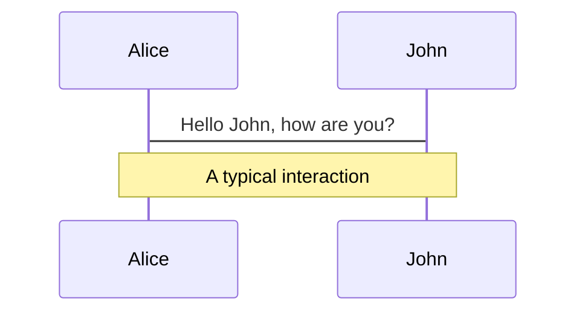
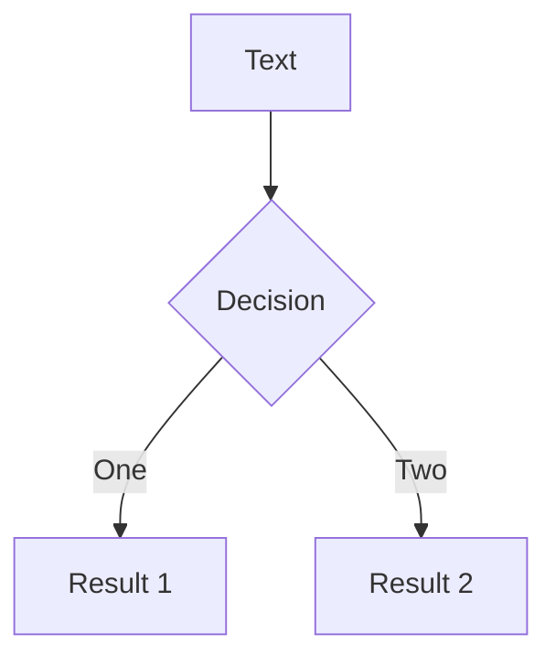
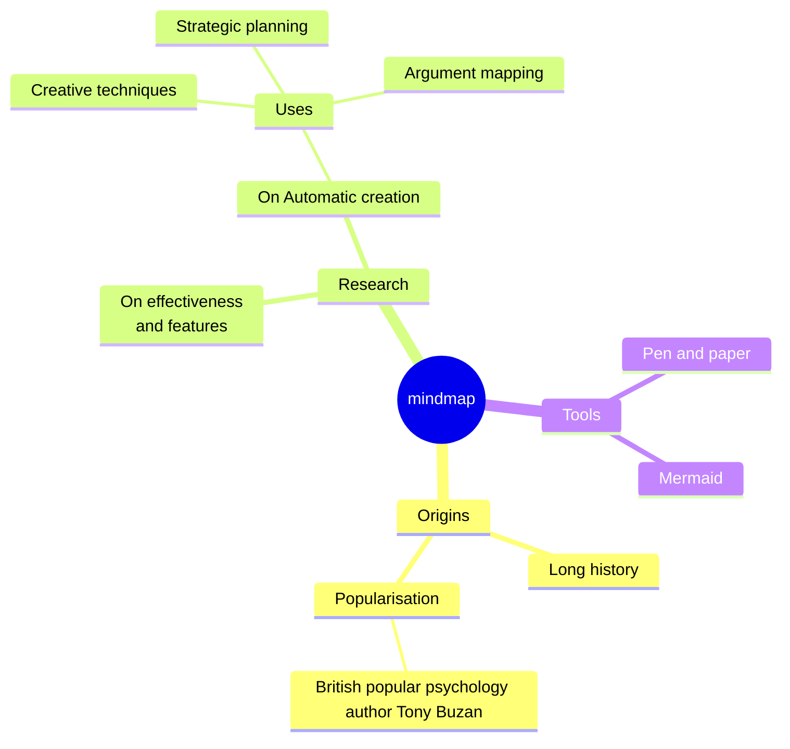
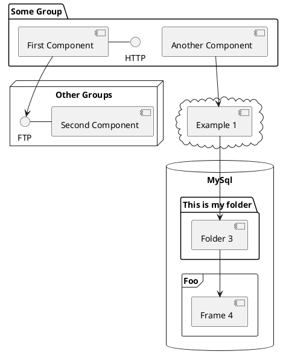

---
# You can also start simply with 'default'
theme: ./theme
# random image from a curated Unsplash collection by Anthony
# like them? see https://unsplash.com/collections/94734566/slidev
background: https://cover.sli.dev
# some information about your slides (markdown enabled)
title: Temporal ... now !!!
#info: |
#  Temporal usage in april 2025
# apply unocss classes to the current slide
class: text-center
# https://sli.dev/features/drawing
drawings:
  persist: false
# slide transition: https://sli.dev/guide/animations.html#slide-transitions
transition: slide-left
# enable MDC Syntax: https://sli.dev/features/mdc
mdc: true
---

# Temporal API

La gestion des dates du futur... sans attendre !!!

<div class="abs-bl m-6 text-xl">
  <span>Fred Guillaume</span>
  <a href="https://github.com/Fred-el-Jolo/" target="_blank" class="slidev-icon-btn">
    <carbon:logo-github />
  </a>
  <a href="https://www.linkedin.com/in/fredericguillaume/" target="_blank" class="slidev-icon-btn">
    <carbon:logo-linkedin />
  </a>
</div>

<div class="abs-br m-6 text-xl">
  <button @click="$slidev.nav.openInEditor" title="Open in Editor" class="slidev-icon-btn">
    <carbon:edit />
  </button>
</div>

<!--
The last comment block of each slide will be treated as slide notes. It will be visible and editable in Presenter Mode along with the slide. [Read more in the docs](https://sli.dev/guide/syntax.html#notes)
-->

---
transition: fade-out
---

# Le temps, qu'est ce c'est ?

<v-click>

Mesure de <span v-mark.highlight.orange="1">durées</span>, planification d'<span v-mark.highlight.orange="1">événements</span> qui rythme notre vie quotidienne.

Notre expérience quotidienne du temps nous semble simple, avec une approche intuitive.

Mais cela reste une expérience très <span v-mark.underline.red="2">locale</span>, <span v-mark.underline.red="2">culturelle</span> et même parfois avec sa dose de <span v-mark.underline.red="2">politique</span> ; et donc compliquée à généraliser...

</v-click>
<v-click at="+2">

# Comment mesurer le temps ?

</v-click>
<v-click>

- En se basant sur des phénomènes <span v-mark.highlight.orange="4">périodiques</span> (jour, nuit, saisons etc...) ou <span v-mark.highlight.orange="4">quantiques</span> (atomes de quartz, de césium...)

</v-click>
<v-click at="+1">

# Pourquoi c'est important ?

</v-click>
<v-click>

- Synchroniser des systèmes est primordial pour la <span v-mark.underline.red="6">cohérence des données</span>
- Il suffit d'échanger avec des personnes sur d'autres fuseaux horaires pour se rendre compte de la complexité de la gestion du temps

</v-click>

---
transition: fade-out
---

# TAI, UT, UTC, DLS

<v-click>

- <span v-mark.underline.blue="1">TAI (Temps Atomique International):</span> basé sur les atomes de césium
> La seconde est la durée exacte de 9 192 631 770 oscillations (ou périodes) de la transition entre les niveaux hyperfins de l’état fondamental de l’atome de 133Cs (atome au repos T=0K).

</v-click>
<v-click>

- <span v-mark.underline.blue="2">UT1 (Universal Time):</span> basé sur l'observation d'objets celestes vis à vis de la rotation de la terre. Irrégulier.

</v-click>
<v-click>

- <span v-mark.underline.blue="3">UTC (Coordinated Universal Time):</span> Du fait de ses irrégularités, UT1 différe progressivement de TAI.

Afin de garder une consistence entre les deux, UTC a été introduite.

Il suffit alors d'ajouter / de supprimer des <span v-mark.highlight.orange="4">"secondes intercalaires"</span> au TAI pour rester à moins de 0.9s de UT1.

</v-click>
<v-click at="5">

- <span v-mark.underline.blue="5">DST (Daylight saving time):</span> Heure d'été / heure d'hiver.

</v-click>
---
transition: fade-out
---

# Fuseaux horaires


---
transition: fade-out
---

# Fuseaux horaires


---
transition: fade-out
---

# IANA TZ DB - Secondes intercalaires (Leap seconds)
https://www.iana.org/time-zones

<<< @/snippets/leap-seconds.txt#snippet

---
transition: fade-out
---

# IANA TZ DB - évolution du fuseau horaire en France
https://www.iana.org/time-zones

<<< @/snippets/europe.txt#snippet


---
transition: fade-out
---

# JS Date
Le JS a été créé dans la précipitation, et la gestion des dates n'y a pas coupé: l'implémentation JS créée en 1997 était une copie de l'implem `java.util.Date` [\[ref\]](https://developer.mozilla.org/en-US/blog/javascript-temporal-is-coming/#what_is_javascript_temporal)

<v-click>

Ces comportements rigides et non adaptés à une gestion des dates moderne sont compliqués à gérer

</v-click>

<v-clicks>

- une date est forcément associée à une heure (et un timestamp)
- une date est soit définie dans le fuseau horaire (=timezone) de l'utilisateur, soit en UTC
- Pas de support de calendriers non-grégoriens
- une date est mutable
- Les opérations sur les dates et les conversions vers d'autres timezone sont très compliquées à réaliser

</v-clicks>
---
transition: fade-out
---

# JS Date issues

```ts {monaco-run}{ showOutputAt:'1', editorOptions: { lineNumbers:'on'} }
// Output format
const jsSophia = new Date('2025-04-22T18:30:00');

// Test equality between getTimezoneOffset() from 2 different dates ?
console.log(jsSophia.getTimezoneOffset() === new Date().getTimezoneOffset());

```
<v-click>

`getTimezoneOffset()` is date-value independant !!!

</v-click>

---
transition: fade-out
---

# JS Date issues

```ts {monaco-run}{ showOutputAt:'1', editorOptions: { lineNumbers:'on'} }
// Output format
const jsSophia = new Date('2025-04-22T18:30:00');

// Weird APIs
console.log('getDay()', jsSophia.getDay());     // ok, get the day here
console.log('getDate()', jsSophia.getDate());   // Huh... get... the full date here ?

```

<v-click>

`getDay()` return the day of the week while `getDate()` returns the day of the month !!!

</v-click>

---
transition: fade-out
---

# JS Date issues

```ts {monaco-run}{ showOutputAt:'1', editorOptions: { lineNumbers:'on'} }
// Output format
const jsSophia = new Date('2025-04-22T18:30:00');

console.log('getMonth()', jsSophia.getMonth()); // Starts at 0

```

<v-click>

`getMonth()` return the month, starting at 0 !!!

</v-click>

---
transition: fade-out
---

# JS Date issues

```ts {monaco-run}{ showOutputAt:'1', editorOptions: { lineNumbers:'on'} }
// Augment given date by 2 months
const addTwoMonths = (date: Date) => {
  return new Date(date.setMonth(date.getMonth() + 2));
}

// Output format
const jsSophia13 = new Date('2025-04-22T18:30:00');
const jsSophia14 = addTwoMonths(jsSophia13);
console.log(jsSophia13, jsSophia14);

```

<v-click>

Initial date is muted !!!

</v-click>


---
transition: fade-out
---

# JS Date issues

```ts {monaco-run}{ showOutputAt:'1', editorOptions: { lineNumbers:'on'} }
// Augment given date by 2 months
const addTwoMonths = (date: Date) => {
  const clone = structuredClone(date);    // Clone the object now 
  return new Date(clone.setMonth(date.getMonth() + 2));
}

// Output format
const jsSophia13 = new Date('2025-04-22T18:30:00');
const jsSophia14 = addTwoMonths(jsSophia13);
console.log(jsSophia13, jsSophia14);

```

<v-click>

Fixed !!!

</v-click>


---
transition: fade-out
---

# JS Date issues

```ts {monaco-run}{ showOutputAt:'1', editorOptions: { lineNumbers:'on'} }
// Convert to another tz => date, not string
const jsSophia = new Date('2025-04-22T18:30:00');
const jsSophiaInNY = jsSophia.toLocaleString('en-US', {timeZone: 'America/New_York'});

console.log(jsSophia);
console.log(jsSophiaInNY);
//console.log(new Date(jsSophiaInNY));

```
<v-click>

`toLocaleString()` returns a string, which cannot be parsed "as is"

</v-click>


---
transition: fade-out
---


# Solution #01: use libraries (date-fns, moment...)

<v-clicks>

## Intl-based Libraries
- Luxon (successor of Moment.js)
- date-fns-tz (extension for date-fns)
- Day.js (when using its Timezone plugin)


## Non-Intl Libraries (include their time zone data)
- js-joda/timezone (extension for js-joda)
- moment-timezone (extension for Moment.js)
- date-fns-timezone (extension for older 1.x of date-fns)
- BigEasy/TimeZone
- tz.js

Mais... si on regardait ce qui arrive en standard ?

</v-clicks>

---
transition: fade-out
---

# Solution #02: temporal API
Temporal API... ou le proposal toujours dans le pipe, mais qui ne sort jamais...

<v-clicks>

- Repo lancé en 2017
- Atteint le stage 3 du TC39 en mars 2021
- Activé sur Firefox 139 (nightly) le 10 avril 2025 !!! [\[ref\]](https://bugzilla.mozilla.org/show_bug.cgi?id=1912511#[object%20HTMLDivElement])

Hmmm... Mais alors, on va attendre encore pour basculer sur l'API ?

...

...

[Temporal github repo](https://github.com/tc39/proposal-temporal) => "Dev-ready" polyfills dispos, à utiliser avec précaution en prod...

</v-clicks>

---
transition: fade-out
---

# [fullcalendar/temporal-polyfill](https://github.com/fullcalendar/temporal-polyfill)

---
transition: fade-out
---

# Architecture Temporal API
L'API temporal gère plusieurs aspect du temps de manière séparée, sur des namespaces dédiés:

<v-clicks depth="2">

- Le calcul de durée `Temporal.Duration`
- La représentation d'un instant donné dans le temps
  - représentation "timestamp": `Temporal.Instant`
  - représentation d'une date & heure combinés à une timezone `Temporal.ZonedDateTime`
- La représentation des différentes composantes d'une date & heure sans timezone ("wall clock")
  - `Temporal.PlainDateTime`
  - `Temporal.PlainDate`
  - `Temporal.PlainTime`
  - `Temporal.PlainMonthDay`
  - `Temporal.PlainYearMonth`

</v-clicks>

---
transition: fade-out
---


---
transition: fade-out
---


<!--
# Calendars in temporal
https://tc39.es/proposal-temporal/docs/calendar-review.html
- less business centric, in-browser use cases where non ISO calendar more & more used
- emerging markets
- dev burden (i18n require platform & library support)
-->

---
transition: fade-out
---

# Temporal Duration
Les durées temporal peuvent être sérialisées via le format ISO 8601

<v-clicks depth="2">

- `±P nY nM nW nD T nH nM nS`
- Durées calendaires: année, mois, semaine
  - Non-portables
- Durées non-calendaires: heure, minute, seconde...
  - Portable, indépendantes du calendrier

- Les méthodes `round()`, `total()`, `compare()` acceptent une option `relativeTo` afin de fournir les infos nécessaires à l'affichage de durée calendaires.

</v-clicks>

---
transition: fade-out
---

# Temporal playground - #1 durées

```ts {monaco-run}{ editorOptions: { lineNumbers:'on'} }
import { Temporal } from 'temporal-polyfill';

const jsSophia11 = Temporal.ZonedDateTime.from("2022-10-11T18:30:00[Europe/Paris]");
const jsSophia12 = Temporal.ZonedDateTime.from("2023-06-15T18:17:43[Europe/Paris]");
const jsSophia13 = Temporal.ZonedDateTime.from("2025-04-22T18:30:00[Europe/Paris]");

const jsSophia14 = jsSophia13.add(Temporal.Duration.from({months: 2}));

console.log(jsSophia13.since(jsSophia12)/*.toLocaleString()*/);

//console.log(jsSophia14);
//console.log(jsSophia13.since(jsSophia12).round({smallestUnit: 'second'}).toLocaleString());

```

<!--
console.log(jsSophia13.since(jsSophia12).round({
    relativeTo: jsSophia13,
    largestUnit: 'year',
    smallestUnit: 'second'
  }).toLocaleString());

console.log(jsSophia13.since(jsSophia12).add(jsSophia12.since(jsSophia11)).round({
    relativeTo: jsSophia13,
    largestUnit: 'year',
    smallestUnit: 'second'
  }).toLocaleString());

-->

---
transition: fade-out
---

# Temporal playground - #2 "Wall clock"

```ts {monaco-run}{ editorOptions: { lineNumbers:'on'} }
import { Temporal } from 'temporal-polyfill';

const heureMeeting = Temporal.PlainDateTime.from("2023-06-15T10:00:00");

// Convert to Paris timezone
//const heureMeetingParis = heureMeeting;

console.log(heureMeeting);
//console.log('Paris', heureMeetingParis);
```

<!--
const heureMeetingParis = heureMeeting.toZonedDateTime('Europe/Paris');

const heureMeetingNY = heureMeetingParis.withTimeZone('America/New_York');

const heureMeetingUTC = heureMeetingParis.toInstant();
-->


---
transition: fade-out
---

# Temporal playground - #3 Conversions de timezones

```ts {monaco-run}{ editorOptions: { lineNumbers:'on'} }
import { Temporal } from 'temporal-polyfill';

const heureMeeting = Temporal.PlainDateTime.from("2023-06-15T10:00:00");
const heureMeetingParis = heureMeeting.toZonedDateTime('Europe/Paris');

//const heureMeetingNY = heureMeetingParis;   // Use `with*` methods to change date components

//const heureMeetingUTC = heureMeetingParis;  // toInstant() returns an UTC date representing
                                              // an unique point in time

console.log(heureMeeting);
//console.log('Paris', heureMeetingParis);
//console.log('NY', heureMeetingNY);
//console.log('UTC', heureMeetingUTC);
//console.log(heureMeetingParis.offset, heureMeetingNY.offset, heureMeetingUTC);

```
<!--
const heureMeetingNY = heureMeetingParis.withTimeZone('America/New_York');

const heureMeetingUTC = heureMeetingParis.toInstant();
-->


---
transition: fade-out
---

# Temporal playground - #4 Calendriers

```ts {monaco-run}{ editorOptions: { lineNumbers:'on'} }
import { Temporal } from 'temporal-polyfill';

const gregorianDate = Temporal.Now.zonedDateTimeISO();

const chineseDate = gregorianDate.withCalendar("chinese");
console.log(gregorianDate);
console.log(chineseDate);
console.log(gregorianDate.toLocaleString('fr'));
console.log(chineseDate.toLocaleString('fr', {calendar: 'chinese'}));

```
<!--
islamic-umalqura
chinese

zh-CN
-->


---
transition: fade-out
---

# Temporal playground - #5 helpers divers

```ts {monaco-run}{ editorOptions: { lineNumbers:'on'} }
import { Temporal } from 'temporal-polyfill';

const newDate = Temporal.ZonedDateTime.from("2025-04-22T18:30:00[Europe/Paris]");


console.log(newDate);

```
<!--
inLeapYear
monthsInYear
daysInMonth

timezoneId
offset
-->


---
transition: fade-out
---

# Temporal playground - #6 heure d'été / hiver

```ts {monaco-run}{ editorOptions: { lineNumbers:'on'} }
import { Temporal } from 'temporal-polyfill';

//const before2007 = Temporal.ZonedDateTime.from("2006-02-01T00:00:00[America/New_York]");
const from2007 = Temporal.ZonedDateTime.from("2007-02-01T00:00:00[America/New_York]");


//console.log(before2007);
console.log(from2007);

```


---
transition: fade-out
---


# Questions ?


<!--


You can have `style` tag in markdown to override the style for the current page.
Learn more: https://sli.dev/features/slide-scope-style
-->

<!--style>
h1 {
  background-color: #2B90B6;
  background-image: linear-gradient(45deg, #4EC5D4 10%, #146b8c 20%);
  background-size: 100%;
  -webkit-background-clip: text;
  -moz-background-clip: text;
  -webkit-text-fill-color: transparent;
  -moz-text-fill-color: transparent;
}
</style-->

<!--
TAI: Temps Atomique International
UT: Universal Time
UTC: Coordinated Universal Time
# JS date issues:

- It doesn’t support Dates but only Datetimes (all date objects are unix timestamps).
- It doesn’t support time zones other than the user’s local time and UTC.
- The parser’s behaviour is inconsistent from one platform to another.
- The Date object is mutable.
- The behaviour of daylight saving time is unpredictable.
- No support for non-Gregorian calendars.
- No date arithmetic like add or subtract time.
https://medium.com/@raphael.moutard/handling-dates-in-javascript-the-wrong-way-d98cb2835200
https://medium.com/@raphael.moutard/why-programmers-are-so-bad-at-handling-time-part-1-01da6b50c141
https://medium.com/@raphael.moutard/why-programmers-are-so-bad-at-handling-time-part-2-b21aff190bfe


# Perfs benchmark
https://bryntum.com/blog/javascript-temporal-is-it-finally-here/


https://developer.mozilla.org/en-US/blog/javascript-temporal-is-coming/
=> browser status


# TZ db, data & code
https://data.iana.org/time-zones/tz-link.html
https://www.iana.org/time-zones
https://github.com/eggert/tz


# Detailed dates issues
https://toastui.medium.com/handling-time-zone-in-javascript-547e67aa842d


# Pays liés à une TZ
https://en.wikipedia.org/wiki/UTC+09:00


# https://maggiepint.com/category/date-proposal/

# Github temporal
https://github.com/tc39/proposal-temporal


1. Gestion du temps
2. JS Date API => relou !!!
3. Les libs, oui, du standard, ouiiiiiiiiiiiiiiiiiiiiiii !!!
4. statut temporal API
5. polyfill dispos
6. Temporal API - Archi globale
https://tc39.es/proposal-temporal/docs/
=> associés avec calendriers

7. Temporal API - ZonedDateTime

=> chinese calendar

8. Temporal API - PlainDateTime
9. Temporal API - Durations
Calcul entre sessions js sophia


// Getter & setters: local vs UTC
const nye = new Date('2024-12-31T23:00:00Z');
console.log(`year  local: ${nye.getFullYear()} utc: ${nye.getUTCFullYear()}`);
console.log(`month local: ${nye.getMonth()}    utc: ${nye.getUTCMonth()}`);
console.log(`day   local: ${nye.getDate()}     utc: ${nye.getUTCDate()}`);
console.log(`hours local: ${nye.getHours()}    utc: ${nye.getUTCHours()}`);


Intl-based Libraries

New development should choose from one of these implementations, which rely on the Intl API for their time zone data:

    Luxon (successor of Moment.js)
    date-fns-tz (extension for date-fns)
    Day.js (when using its Timezone plugin)

Non-Intl Libraries

These libraries are maintained, but carry the burden of packaging their own time zone data, which can be quite large.

    js-joda/timezone (extension for js-joda)
    moment-timezone* (extension for Moment.js)
    date-fns-timezone (extension for older 1.x of date-fns)
    BigEasy/TimeZone
    tz.js


# Calendars in temporal
https://tc39.es/proposal-temporal/docs/calendar-review.html
- less business centric, in-browser use cases where non ISO calendar more & more used
- emerging markets
- dev burden (i18n require platform & library support)

-->


---
transition: slide-up
level: 2
---

# Navigation

Hover on the bottom-left corner to see the navigation's controls panel, [learn more](https://sli.dev/guide/ui#navigation-bar)

## Keyboard Shortcuts

|                                                     |                             |
| --------------------------------------------------- | --------------------------- |
| <kbd>right</kbd> / <kbd>space</kbd>                 | next animation or slide     |
| <kbd>left</kbd>  / <kbd>shift</kbd><kbd>space</kbd> | previous animation or slide |
| <kbd>up</kbd>                                       | previous slide              |
| <kbd>down</kbd>                                     | next slide                  |

<!-- https://sli.dev/guide/animations.html#click-animation -->

<p v-after class="absolute bottom-23 left-45 opacity-30 transform -rotate-10">Here!</p>

---
layout: two-cols
layoutClass: gap-16
---

# Table of contents

You can use the `Toc` component to generate a table of contents for your slides:

```html
<Toc minDepth="1" maxDepth="1" />
```

The title will be inferred from your slide content, or you can override it with `title` and `level` in your frontmatter.

::right::

<Toc text-sm minDepth="1" maxDepth="2" />

---
layout: image-right
image: https://cover.sli.dev
---

# Code

Use code snippets and get the highlighting directly, and even types hover!

```ts {all|5|7|7-8|10|all} twoslash
// TwoSlash enables TypeScript hover information
// and errors in markdown code blocks
// More at https://shiki.style/packages/twoslash

import { computed, ref } from 'vue'

const count = ref(0)
const doubled = computed(() => count.value * 2)

doubled.value = 2
```

<arrow v-click="[4, 5]" x1="350" y1="310" x2="195" y2="334" color="#953" width="2" arrowSize="1" />

<!-- This allow you to embed external code blocks -->
<<< @/snippets/external.ts#snippet

<!-- Footer -->

[Learn more](https://sli.dev/features/line-highlighting)

<!-- Inline style -->
<style>
.footnotes-sep {
  @apply mt-5 opacity-10;
}
.footnotes {
  @apply text-sm opacity-75;
}
.footnote-backref {
  display: none;
}
</style>

<!--
Notes can also sync with clicks

[click] This will be highlighted after the first click

[click] Highlighted with `count = ref(0)`

[click:3] Last click (skip two clicks)
-->

---
level: 2
---

# Shiki Magic Move

Powered by [shiki-magic-move](https://shiki-magic-move.netlify.app/), Slidev supports animations across multiple code snippets.

Add multiple code blocks and wrap them with <code>````md magic-move</code> (four backticks) to enable the magic move. For example:

````md magic-move {lines: true}
```ts {*|2|*}
// step 1
const author = reactive({
  name: 'John Doe',
  books: [
    'Vue 2 - Advanced Guide',
    'Vue 3 - Basic Guide',
    'Vue 4 - The Mystery'
  ]
})
```

```ts {*|1-2|3-4|3-4,8}
// step 2
export default {
  data() {
    return {
      author: {
        name: 'John Doe',
        books: [
          'Vue 2 - Advanced Guide',
          'Vue 3 - Basic Guide',
          'Vue 4 - The Mystery'
        ]
      }
    }
  }
}
```

```ts
// step 3
export default {
  data: () => ({
    author: {
      name: 'John Doe',
      books: [
        'Vue 2 - Advanced Guide',
        'Vue 3 - Basic Guide',
        'Vue 4 - The Mystery'
      ]
    }
  })
}
```

Non-code blocks are ignored.

```vue
<!-- step 4 -->
<script setup>
const author = {
  name: 'John Doe',
  books: [
    'Vue 2 - Advanced Guide',
    'Vue 3 - Basic Guide',
    'Vue 4 - The Mystery'
  ]
}
</script>
```
````

---

# Components

<div grid="~ cols-2 gap-4">
<div>

You can use Vue components directly inside your slides.

We have provided a few built-in components like `<Tweet/>` and `<Youtube/>` that you can use directly. And adding your custom components is also super easy.

```html
<Counter :count="10" />
```

<!-- ./components/Counter.vue -->
<Counter :count="10" m="t-4" />

Check out [the guides](https://sli.dev/builtin/components.html) for more.

</div>
<div>

```html
<Tweet id="1390115482657726468" />
```

<Tweet id="1390115482657726468" scale="0.65" />

</div>
</div>

<!--
Presenter note with **bold**, *italic*, and ~~striked~~ text.

Also, HTML elements are valid:
<div class="flex w-full">
  <span style="flex-grow: 1;">Left content</span>
  <span>Right content</span>
</div>
-->

---
class: px-20
---

# Themes

Slidev comes with powerful theming support. Themes can provide styles, layouts, components, or even configurations for tools. Switching between themes by just **one edit** in your frontmatter:

<div grid="~ cols-2 gap-2" m="t-2">

```yaml
---
theme: default
---
```

```yaml
---
theme: seriph
---
```


</div>

Read more about [How to use a theme](https://sli.dev/guide/theme-addon#use-theme) and
check out the [Awesome Themes Gallery](https://sli.dev/resources/theme-gallery).

---

# Clicks Animations

You can add `v-click` to elements to add a click animation.

<div v-click>

This shows up when you click the slide:

```html
<div v-click>This shows up when you click the slide.</div>
```

</div>

<br>

<v-click>

The <span v-mark.red="3"><code>v-mark</code> directive</span>
also allows you to add
<span v-mark.circle.orange="4">inlinee marks</span>
, powered by [Rough Notation](https://roughnotation.com/):

```html
<span v-mark.underline.orange>inline markers</span>
```

</v-click>

<div mt-20 v-click>

[Learn more](https://sli.dev/guide/animations#click-animation)

</div>

---

# Motions

Motion animations are powered by [@vueuse/motion](https://motion.vueuse.org/), triggered by `v-motion` directive.

```html
<div
  v-motion
  :initial="{ x: -80 }"
  :enter="{ x: 0 }"
  :click-3="{ x: 80 }"
  :leave="{ x: 1000 }"
>
  Slidev
</div>
```

<div class="w-60 relative">
  <div class="relative w-40 h-40">
    
    
    
  </div>

  <div
    class="text-5xl absolute top-14 left-40 text-[#2B90B6] -z-1"
    v-motion
    :initial="{ x: -80, opacity: 0}"
    :enter="{ x: 0, opacity: 1, transition: { delay: 2000, duration: 1000 } }">
    Slidev
  </div>
</div>

<!-- vue script setup scripts can be directly used in markdown, and will only affects current page -->
<script setup lang="ts">
const final = {
  x: 0,
  y: 0,
  rotate: 0,
  scale: 1,
  transition: {
    type: 'spring',
    damping: 10,
    stiffness: 20,
    mass: 2
  }
}
</script>

<div
  v-motion
  :initial="{ x:35, y: 30, opacity: 0}"
  :enter="{ y: 0, opacity: 1, transition: { delay: 3500 } }">

[Learn more](https://sli.dev/guide/animations.html#motion)

</div>

---

# LaTeX

LaTeX is supported out-of-box. Powered by [KaTeX](https://katex.org/).

<div h-3 />

Inline $\sqrt{3x-1}+(1+x)^2$

Block
$$ {1|3|all}
\begin{aligned}
\nabla \cdot \vec{E} &= \frac{\rho}{\varepsilon_0} \\
\nabla \cdot \vec{B} &= 0 \\
\nabla \times \vec{E} &= -\frac{\partial\vec{B}}{\partial t} \\
\nabla \times \vec{B} &= \mu_0\vec{J} + \mu_0\varepsilon_0\frac{\partial\vec{E}}{\partial t}
\end{aligned}
$$

[Learn more](https://sli.dev/features/latex)

---

# Diagrams

You can create diagrams / graphs from textual descriptions, directly in your Markdown.

<div class="grid grid-cols-4 gap-5 pt-4 -mb-6">









</div>

Learn more: [Mermaid Diagrams](https://sli.dev/features/mermaid) and [PlantUML Diagrams](https://sli.dev/features/plantuml)

---
foo: bar
dragPos:
  square: -71,0,0,0
---

# Draggable Elements

Double-click on the draggable elements to edit their positions.

<br>

###### Directive Usage

```md

```

<br>

###### Component Usage

```md
<v-drag text-3xl>
  <div class="i-carbon:arrow-up" />
  Use the `v-drag` component to have a draggable container!
</v-drag>
```

<v-drag pos="368,487,261,_,8">
  <div text-center text-3xl border border-main rounded>
    Double-click me!
  </div>
</v-drag>


###### Draggable Arrow

```md
<v-drag-arrow two-way />
```

<v-drag-arrow pos="261,141,382,23" two-way op70 />

---
src: ./pages/imported-slides.md
hide: false
---

---

# Monaco Editor

Slidev provides built-in Monaco Editor support.

Add `{monaco}` to the code block to turn it into an editor:

```ts {monaco}
import { ref } from 'vue'
import { emptyArray } from './external'

const arr = ref(emptyArray(10))
```

Use `{monaco-run}` to create an editor that can execute the code directly in the slide:

```ts {monaco-run}
import { version } from 'vue'
import { emptyArray, sayHello } from './external'

sayHello()
console.log(`vue ${version}`)
console.log(emptyArray<number>(10).reduce(fib => [...fib, fib.at(-1)! + fib.at(-2)!], [1, 1]))
```

---
layout: center
class: text-center
---

# Learn More

[Documentation](https://sli.dev) · [GitHub](https://github.com/slidevjs/slidev) · [Showcases](https://sli.dev/resources/showcases)


<PoweredBySlidev mt-10 />
