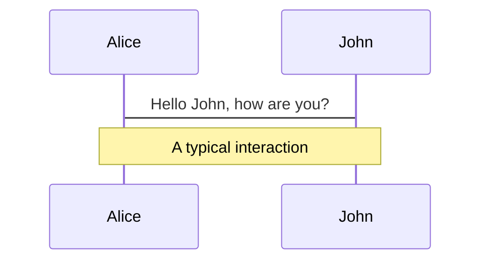
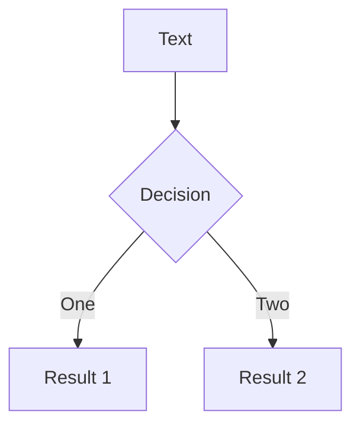
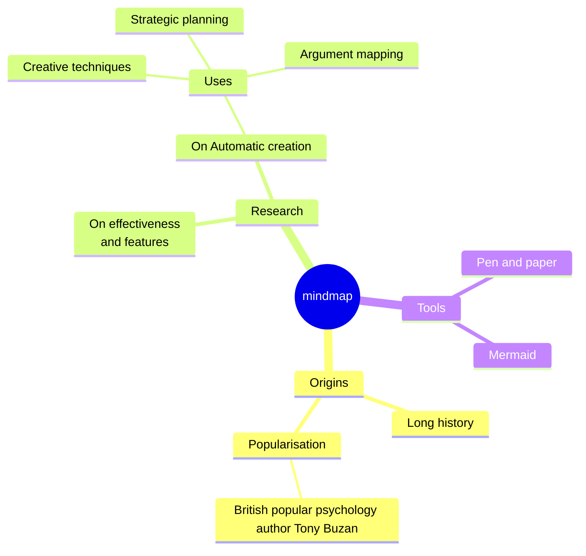
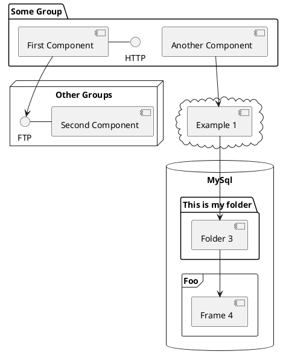

---
# You can also start simply with 'default'
theme: seriph
# random image from a curated Unsplash collection by Anthony
# like them? see https://unsplash.com/collections/94734566/slidev
background: https://cover.sli.dev
# some information about your slides (markdown enabled)
title: Temporal
info: |
  Temporal usage in april 2025
# apply unocss classes to the current slide
class: text-center
# https://sli.dev/features/drawing
drawings:
  persist: false
# slide transition: https://sli.dev/guide/animations.html#slide-transitions
transition: slide-left
# enable MDC Syntax: https://sli.dev/features/mdc
mdc: true
---

# Temporal API

La gestion des dates du futur... sans attendre !!!

<div class="abs-bl m-6 text-xl">
  <span>Fred Guillaume</span>
  <a href="https://github.com/Fred-el-Jolo/" target="_blank" class="slidev-icon-btn">
    <carbon:logo-github />
  </a>
  <a href="https://www.linkedin.com/in/fredericguillaume/" target="_blank" class="slidev-icon-btn">
    <carbon:logo-linkedin />
  </a>
</div>

<div class="abs-br m-6 text-xl">
  <button @click="$slidev.nav.openInEditor" title="Open in Editor" class="slidev-icon-btn">
    <carbon:edit />
  </button>
</div>

<!--
The last comment block of each slide will be treated as slide notes. It will be visible and editable in Presenter Mode along with the slide. [Read more in the docs](https://sli.dev/guide/syntax.html#notes)
-->

---
transition: fade-out
---

# Le temps, qu'est ce c'est ?
Mesure de durées, qui nous impacte dans notre vie de tous les jours.
Notre expérience quotidienne du temps nous semble simple, mais reste une expérience très locale et culturelle 

# Comment mesurer le temps ?
- En se basant sur des phénomènes périodiques (jour, nuit, saisons etc...) ou quantiques (atomes de quartz, de césium...)

# Pourquoi c'est important ?
- Il suffit d'échanger avec des personnes sur d'autres fuseaux horaires pour se rendre compte de la complexité de la gestion du temps
- Synchroniser des systèmes est primordial pour la cohérence des données

---
transition: fade-out
---

# TAI, UT, UTC, DLS
- TAI (Temps Atomique International): basé sur les atomes de césium
> La seconde est la durée exacte de 9 192 631 770 oscillations (ou périodes) de la transition entre les niveaux hyperfins de l’état fondamental de l’atome de 133Cs (atome au repos T=0K).

- UT1 (Universal Time): basé sur l'observation d'objets celestes vis à vis de la rotation de la terre. Irrégulier.
- UTC (Coordinated Universal Time): Du fait de ses irrégularités, UT1 différe progressivement de TAI. Afin de garder une consistence entre les deux, UTC a été introduite.
Elle consiste à ajouter / supprimer des "secondes intercalaires au TAI pour rester à moins de 0.9s de UT1.
- DSL (Daylight saving time): Heure d'été / heure d'hiver

---
transition: fade-out
---

# JS Date - constructor (1/)
- une date est forcément associée à une heure (et un timestamp)
- une date est soit définie dans le fuseau horaire (=timezone) de l'utilisateur, soit en UTC
- Offset
   - `Z`: UTC
   - `+HH:mm`: décalage avec l'UTC en heures & minutes


```ts {monaco-run}
// Date constructors
console.log(new Date())                             // Empty constructor = now
console.log(new Date(1745346600000));               // Constructor with unix timestamp
console.log(new Date('1970-01-01'));                // UTC
// Datetime constructors
console.log(new Date('1970-01-01T00:00:00'));       // Local timezone
console.log(new Date('1970-01-01T10:00:00Z'));       // UTC
console.log(new Date('1970-01-01T00:00:00-05:00')); // -5h offset
```

---
transition: fade-out
---

# JS Date - getters (& setters) (2/)

<DateAPI input="2024-12-31T23:00:00Z" />

<!-- 
// Getter & setters: local vs UTC
const nye = new Date('2024-12-31T23:00:00Z');
console.log(`year  local: ${nye.getFullYear()} utc: ${nye.getUTCFullYear()}`);
console.log(`month local: ${nye.getMonth()}    utc: ${nye.getUTCMonth()}`);
console.log(`day   local: ${nye.getDate()}     utc: ${nye.getUTCDate()}`);
console.log(`hours local: ${nye.getHours()}    utc: ${nye.getUTCHours()}`);
-->


---
transition: fade-out
---

# JS Date - outputs (3/)
ISO String
Date string
Time string
Locale date string
Locale time string
Locale string
UTC String

```ts {monaco}
// Output format
const now = new Date('2025-04-22T18:30:00');
console.log(now.toDateString());          // Tue Apr 22 2025
console.log(now.toISOString());           // 2025-04-22T16:30:00.000Z
console.log(now.toJSON());                // 2025-04-22T16:30:00.000Z
console.log(now.toLocaleDateString());    // 22/04/2025
console.log(now.toLocaleString());        // 22/04/2025 18:30:00
console.log(now.toLocaleString("en-US")); // 4/22/2025, 6:30:00 PM
console.log(now.toLocaleString("en-US", {timeZone: "UTC"}));  // 4/22/2025, 4:30:00 PM
console.log(now.toLocaleTimeString());    // 18:30:00
console.log(now.toString());              // Tue Apr 22 2025 18:30:00 GMT+0200 (heure d’été d’Europe centrale)
console.log(now.toTimeString());          // 18:30:00 GMT+0200 (heure d’été d’Europe centrale)
console.log(now.toUTCString());           // Tue, 22 Apr 2025 16:30:00 GMT
```


---
transition: fade-out
---

# JS Date - common issues (4/)

The TimezoneOffset trap !!! 
Day of week VS day of month
Months range

```ts {monaco-run}
// Output format
const jsSophia = new Date('2025-04-22T18:30:00');
console.log(jsSophia.getTimezoneOffset());

console.log(jsSophia.getDay());
console.log(jsSophia.getDate());

console.log(jsSophia.getMonth());
```

---
transition: fade-out
---

# JS Date - common issues (5/)

Mutable date
Date arithmetics

```ts {monaco-run}
const addTwoMonths = (date) => {
  //const clone = structuredClone(date);
  return new Date(date.setMonth(date.getMonth() + 2));
}

// Output format
const jsSophia13 = new Date('2025-04-22T18:30:00');
const jsSophia14 = addTwoMonths(jsSophia13);
console.log(jsSophia13, jsSophia14);

const december2025 = new Date('2025-12-24');
const february2026 =addTwoMonths(december2025);
console.log(december2025, february2026);
```


Support of non gregorian calendars

Ex: horloge multi pays
instance 1 date, + offset, - offset


---
transition: fade-out
---

# Solution #01: use libraries (date-fns, moment...)


---
transition: fade-out
---

# Solution #02: temporal API
L'API temporal gère plusieurs aspect du temps de manière séparée, sur des namespaces dédiés:
- Le calcul de durée `Temporal.Duration`
- La représentation d'un instant donné dans le temps
  - représentation "timestamp": `Temporal.Instant`
  - représentation d'une date & heure combinés à une timezone `Temporal.ZonedDateTime`
- La représentation des différentes composantes d'une date & heure sans timezone ("wall clock")
  - `Temporal.PlainDateTime`
  - `Temporal.PlainDate`
  - `Temporal.PlainMonthDay`
  - `Temporal.PlainTime`


---
transition: fade-out
---

# Pbs Date API


```ts {monaco-run}
import { Temporal } from 'temporal-polyfill';

//console.log(Temporal.Now.zonedDateTimeISO().toString());

const jsSophia12 = Temporal.ZonedDateTime.from(
  "2023-06-15T18:35:48[Europe/Paris]",
);

const jsSophia13 = Temporal.ZonedDateTime.from(
  "2025-04-22T18:30:00[Europe/Paris]",
);

const jsSophia14 = jsSophia13.add(Temporal.Duration.from({months: 2}));

const heureMeeting = Temporal.PlainDateTime.from(
  "2023-06-15T10:00:00",
);

const heureMeetingParis = heureMeeting.toZonedDateTime('Europe/Paris');

const heureMeetingNY = heureMeetingParis.withTimeZone('America/New_York');
const heureMeetingUTC = heureMeetingParis.toInstant();

//console.log(jsSophia13.since(jsSophia12).toLocaleString());
//console.log(jsSophia13.since(jsSophia12).round({relativeTo: jsSophia13, smallestUnit: 'minute',  largestUnit: 'year'}).toLocaleString());
//console.log(jsSophia14);
console.log(heureMeetingParis.offset, heureMeetingNY.offset, heureMeetingUTC);

const zdt = Temporal.ZonedDateTime.from(
  "2021-07-01T12:34:56[America/New_York]",
);
const newZDT = zdt.withCalendar("islamic-umalqura");
//console.log(newZDT.toLocaleString("en-US", { calendar: "islamic-umalqura" }));
```

---
transition: fade-out
---

# Pbs Date API


---
transition: fade-out
---


# TODO

- horloge synchro pays
  - heure été / hiver
  - computing week number
  - first day of year


- Planif dates multi fuseau horaire
  - 


---
transition: fade-out
---

# JS Date

---
transition: fade-out
---

# Status TC 39 Temporal


<!--


You can have `style` tag in markdown to override the style for the current page.
Learn more: https://sli.dev/features/slide-scope-style
-->

<!--style>
h1 {
  background-color: #2B90B6;
  background-image: linear-gradient(45deg, #4EC5D4 10%, #146b8c 20%);
  background-size: 100%;
  -webkit-background-clip: text;
  -moz-background-clip: text;
  -webkit-text-fill-color: transparent;
  -moz-text-fill-color: transparent;
}
</style-->

<!--
TAI: Temps Atomique International
UT: Universal Time
UTC: Coordinated Universal Time
# JS date issues:

- It doesn’t support Dates but only Datetimes (all date objects are unix timestamps).
- It doesn’t support time zones other than the user’s local time and UTC.
- The parser’s behaviour is inconsistent from one platform to another.
- The Date object is mutable.
- The behaviour of daylight saving time is unpredictable.
- No support for non-Gregorian calendars.
- No date arithmetic like add or subtract time.
https://medium.com/@raphael.moutard/handling-dates-in-javascript-the-wrong-way-d98cb2835200
https://medium.com/@raphael.moutard/why-programmers-are-so-bad-at-handling-time-part-1-01da6b50c141
https://medium.com/@raphael.moutard/why-programmers-are-so-bad-at-handling-time-part-2-b21aff190bfe


# Perfs benchmark
https://bryntum.com/blog/javascript-temporal-is-it-finally-here/


https://developer.mozilla.org/en-US/blog/javascript-temporal-is-coming/
=> browser status


# TZ db, data & code
https://data.iana.org/time-zones/tz-link.html
https://www.iana.org/time-zones
https://github.com/eggert/tz


# Detailed dates issues
https://toastui.medium.com/handling-time-zone-in-javascript-547e67aa842d


# Pays liés à une TZ
https://en.wikipedia.org/wiki/UTC+09:00


# https://maggiepint.com/category/date-proposal/

# Github temporal
https://github.com/tc39/proposal-temporal


1. Gestion du temps
2. JS Date API => relou !!!
3. Les libs, oui, du standard, ouiiiiiiiiiiiiiiiiiiiiiii !!!
4. statut temporal API
5. polyfill dispos
6. Temporal API - Archi globale
https://tc39.es/proposal-temporal/docs/
=> associés avec calendriers

7. Temporal API - ZonedDateTime

=> chinese calendar

8. Temporal API - PlainDateTime
9. Temporal API - Durations
Calcul entre sessions js sophia


-->

---
transition: slide-up
level: 2
---

# Navigation

Hover on the bottom-left corner to see the navigation's controls panel, [learn more](https://sli.dev/guide/ui#navigation-bar)

## Keyboard Shortcuts

|                                                     |                             |
| --------------------------------------------------- | --------------------------- |
| <kbd>right</kbd> / <kbd>space</kbd>                 | next animation or slide     |
| <kbd>left</kbd>  / <kbd>shift</kbd><kbd>space</kbd> | previous animation or slide |
| <kbd>up</kbd>                                       | previous slide              |
| <kbd>down</kbd>                                     | next slide                  |

<!-- https://sli.dev/guide/animations.html#click-animation -->

<p v-after class="absolute bottom-23 left-45 opacity-30 transform -rotate-10">Here!</p>

---
layout: two-cols
layoutClass: gap-16
---

# Table of contents

You can use the `Toc` component to generate a table of contents for your slides:

```html
<Toc minDepth="1" maxDepth="1" />
```

The title will be inferred from your slide content, or you can override it with `title` and `level` in your frontmatter.

::right::

<Toc text-sm minDepth="1" maxDepth="2" />

---
layout: image-right
image: https://cover.sli.dev
---

# Code

Use code snippets and get the highlighting directly, and even types hover!

```ts {all|5|7|7-8|10|all} twoslash
// TwoSlash enables TypeScript hover information
// and errors in markdown code blocks
// More at https://shiki.style/packages/twoslash

import { computed, ref } from 'vue'

const count = ref(0)
const doubled = computed(() => count.value * 2)

doubled.value = 2
```

<arrow v-click="[4, 5]" x1="350" y1="310" x2="195" y2="334" color="#953" width="2" arrowSize="1" />

<!-- This allow you to embed external code blocks -->
<<< @/snippets/external.ts#snippet

<!-- Footer -->

[Learn more](https://sli.dev/features/line-highlighting)

<!-- Inline style -->
<style>
.footnotes-sep {
  @apply mt-5 opacity-10;
}
.footnotes {
  @apply text-sm opacity-75;
}
.footnote-backref {
  display: none;
}
</style>

<!--
Notes can also sync with clicks

[click] This will be highlighted after the first click

[click] Highlighted with `count = ref(0)`

[click:3] Last click (skip two clicks)
-->

---
level: 2
---

# Shiki Magic Move

Powered by [shiki-magic-move](https://shiki-magic-move.netlify.app/), Slidev supports animations across multiple code snippets.

Add multiple code blocks and wrap them with <code>````md magic-move</code> (four backticks) to enable the magic move. For example:

````md magic-move {lines: true}
```ts {*|2|*}
// step 1
const author = reactive({
  name: 'John Doe',
  books: [
    'Vue 2 - Advanced Guide',
    'Vue 3 - Basic Guide',
    'Vue 4 - The Mystery'
  ]
})
```

```ts {*|1-2|3-4|3-4,8}
// step 2
export default {
  data() {
    return {
      author: {
        name: 'John Doe',
        books: [
          'Vue 2 - Advanced Guide',
          'Vue 3 - Basic Guide',
          'Vue 4 - The Mystery'
        ]
      }
    }
  }
}
```

```ts
// step 3
export default {
  data: () => ({
    author: {
      name: 'John Doe',
      books: [
        'Vue 2 - Advanced Guide',
        'Vue 3 - Basic Guide',
        'Vue 4 - The Mystery'
      ]
    }
  })
}
```

Non-code blocks are ignored.

```vue
<!-- step 4 -->
<script setup>
const author = {
  name: 'John Doe',
  books: [
    'Vue 2 - Advanced Guide',
    'Vue 3 - Basic Guide',
    'Vue 4 - The Mystery'
  ]
}
</script>
```
````

---

# Components

<div grid="~ cols-2 gap-4">
<div>

You can use Vue components directly inside your slides.

We have provided a few built-in components like `<Tweet/>` and `<Youtube/>` that you can use directly. And adding your custom components is also super easy.

```html
<Counter :count="10" />
```

<!-- ./components/Counter.vue -->
<Counter :count="10" m="t-4" />

Check out [the guides](https://sli.dev/builtin/components.html) for more.

</div>
<div>

```html
<Tweet id="1390115482657726468" />
```

<Tweet id="1390115482657726468" scale="0.65" />

</div>
</div>

<!--
Presenter note with **bold**, *italic*, and ~~striked~~ text.

Also, HTML elements are valid:
<div class="flex w-full">
  <span style="flex-grow: 1;">Left content</span>
  <span>Right content</span>
</div>
-->

---
class: px-20
---

# Themes

Slidev comes with powerful theming support. Themes can provide styles, layouts, components, or even configurations for tools. Switching between themes by just **one edit** in your frontmatter:

<div grid="~ cols-2 gap-2" m="t-2">

```yaml
---
theme: default
---
```

```yaml
---
theme: seriph
---
```


</div>

Read more about [How to use a theme](https://sli.dev/guide/theme-addon#use-theme) and
check out the [Awesome Themes Gallery](https://sli.dev/resources/theme-gallery).

---

# Clicks Animations

You can add `v-click` to elements to add a click animation.

<div v-click>

This shows up when you click the slide:

```html
<div v-click>This shows up when you click the slide.</div>
```

</div>

<br>

<v-click>

The <span v-mark.red="3"><code>v-mark</code> directive</span>
also allows you to add
<span v-mark.circle.orange="4">inlinee marks</span>
, powered by [Rough Notation](https://roughnotation.com/):

```html
<span v-mark.underline.orange>inline markers</span>
```

</v-click>

<div mt-20 v-click>

[Learn more](https://sli.dev/guide/animations#click-animation)

</div>

---

# Motions

Motion animations are powered by [@vueuse/motion](https://motion.vueuse.org/), triggered by `v-motion` directive.

```html
<div
  v-motion
  :initial="{ x: -80 }"
  :enter="{ x: 0 }"
  :click-3="{ x: 80 }"
  :leave="{ x: 1000 }"
>
  Slidev
</div>
```

<div class="w-60 relative">
  <div class="relative w-40 h-40">
    
    
    
  </div>

  <div
    class="text-5xl absolute top-14 left-40 text-[#2B90B6] -z-1"
    v-motion
    :initial="{ x: -80, opacity: 0}"
    :enter="{ x: 0, opacity: 1, transition: { delay: 2000, duration: 1000 } }">
    Slidev
  </div>
</div>

<!-- vue script setup scripts can be directly used in markdown, and will only affects current page -->
<script setup lang="ts">
const final = {
  x: 0,
  y: 0,
  rotate: 0,
  scale: 1,
  transition: {
    type: 'spring',
    damping: 10,
    stiffness: 20,
    mass: 2
  }
}
</script>

<div
  v-motion
  :initial="{ x:35, y: 30, opacity: 0}"
  :enter="{ y: 0, opacity: 1, transition: { delay: 3500 } }">

[Learn more](https://sli.dev/guide/animations.html#motion)

</div>

---

# LaTeX

LaTeX is supported out-of-box. Powered by [KaTeX](https://katex.org/).

<div h-3 />

Inline $\sqrt{3x-1}+(1+x)^2$

Block
$$ {1|3|all}
\begin{aligned}
\nabla \cdot \vec{E} &= \frac{\rho}{\varepsilon_0} \\
\nabla \cdot \vec{B} &= 0 \\
\nabla \times \vec{E} &= -\frac{\partial\vec{B}}{\partial t} \\
\nabla \times \vec{B} &= \mu_0\vec{J} + \mu_0\varepsilon_0\frac{\partial\vec{E}}{\partial t}
\end{aligned}
$$

[Learn more](https://sli.dev/features/latex)

---

# Diagrams

You can create diagrams / graphs from textual descriptions, directly in your Markdown.

<div class="grid grid-cols-4 gap-5 pt-4 -mb-6">









</div>

Learn more: [Mermaid Diagrams](https://sli.dev/features/mermaid) and [PlantUML Diagrams](https://sli.dev/features/plantuml)

---
foo: bar
dragPos:
  square: 0,-125,0,0
---

# Draggable Elements

Double-click on the draggable elements to edit their positions.

<br>

###### Directive Usage

```md

```

<br>

###### Component Usage

```md
<v-drag text-3xl>
  <div class="i-carbon:arrow-up" />
  Use the `v-drag` component to have a draggable container!
</v-drag>
```

<v-drag pos="368,487,261,_,8">
  <div text-center text-3xl border border-main rounded>
    Double-click me!
  </div>
</v-drag>


###### Draggable Arrow

```md
<v-drag-arrow two-way />
```

<v-drag-arrow pos="261,141,382,23" two-way op70 />

---
src: ./pages/imported-slides.md
hide: false
---

---

# Monaco Editor

Slidev provides built-in Monaco Editor support.

Add `{monaco}` to the code block to turn it into an editor:

```ts {monaco}
import { ref } from 'vue'
import { emptyArray } from './external'

const arr = ref(emptyArray(10))
```

Use `{monaco-run}` to create an editor that can execute the code directly in the slide:

```ts {monaco-run}
import { version } from 'vue'
import { emptyArray, sayHello } from './external'

sayHello()
console.log(`vue ${version}`)
console.log(emptyArray<number>(10).reduce(fib => [...fib, fib.at(-1)! + fib.at(-2)!], [1, 1]))
```

---
layout: center
class: text-center
---

# Learn More

[Documentation](https://sli.dev) · [GitHub](https://github.com/slidevjs/slidev) · [Showcases](https://sli.dev/resources/showcases)

<PoweredBySlidev mt-10 />
